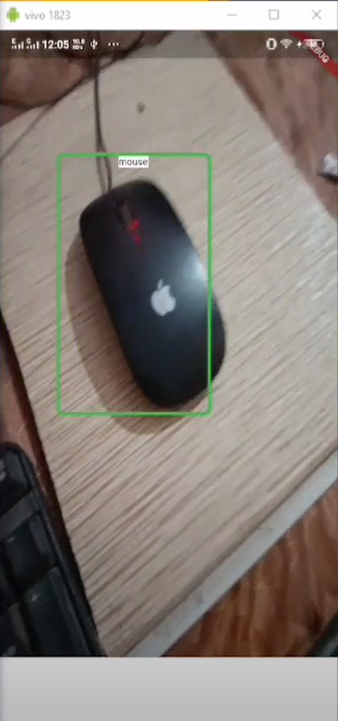

# Flutter Realtime Object Detection 

A mobile app that detects common objects in realtime via rear camera smartphone

Implemented from [Flutter AI | Flutter Realtime Object Detection | Flutter Deep Learning | Flutter TensorFlow | TFlite](https://www.youtube.com/playlist?list=PL-7EgTNrNHKYrQZCdyB2u9U6GZLmLusyW) by Baaba Devs

## Maintainer: 
[bluelul](https://bluelul.com)

If you find this repository helpful, please give it a star ⭐ !

## Note
- JDK 17
- Graddle > 8
- Android SDK ~34

## Demo

## Getting Started

This project is a starting point for a Flutter application.

A few resources to get you started if this is your first Flutter project:

- [Lab: Write your first Flutter app](https://docs.flutter.dev/get-started/codelab)
- [Cookbook: Useful Flutter samples](https://docs.flutter.dev/cookbook)

For help getting started with Flutter development, view the
[online documentation](https://docs.flutter.dev/), which offers tutorials,
samples, guidance on mobile development, and a full API reference.
